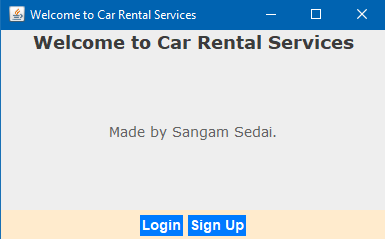
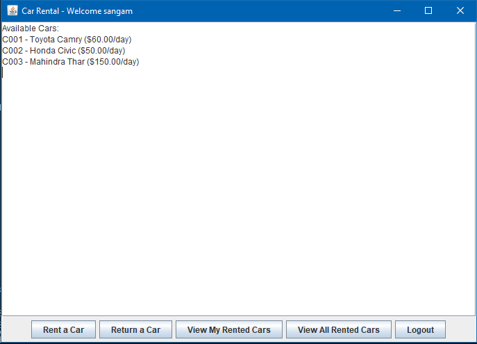

🚗 Car Rental System (Java Swing GUI)
This is a beginner-friendly Java Swing GUI application for a Car Rental System. Users can log in or sign up, rent cars, return them, and view rented cars. Each car rented is linked to the specific user account.

✅ Features
🔐 Login and Signup system

🚘 Rent a car (select car and rental days)

🔄 Return a rented car

👤 View your rented cars

📋 View all rented cars (admin-style view)

🔓 Logout and return to login screen

🛠️ Tools and Technologies
Java

Java Swing (for GUI)

OOP concepts (Class, Object, Encapsulation)

No database (uses ArrayList for data storage)

🗂️ Project Structure
plaintext
Copy
Edit
├── Main.java              // Starts the application
├── Car.java               // Car model with rent and return logic
├── UserAccount.java       // User data with rented car list
├── LoginFrame.java        // Login and Signup screen
├── CarRentalFrame.java    // Main dashboard after login
🚀 How to Run
Open the project in your Java IDE (like IntelliJ, Eclipse, or VS Code).

Make sure all .java files are in the same package or folder.

Run the Main.java file.

A login/signup window will appear to get started.

🔎 Example Flow
Run the app → Sign Up with a new username & password

Log in → See the dashboard

Rent a car → Choose from available cars

Return a car → Only the cars rented by you

View rented cars → See your list

View all rented cars → See what others have rented too

## 📸 Screenshots

> 💡 Save your screenshots inside an `images/` folder and make sure to commit them with your project!

### 🔐 Login and Signup

### 🏠 Main Dashboard

 

📚 Concepts Used
Classes & Objects

ArrayList for managing cars and users

Basic Swing UI components (JFrame, JPanel, JButton, JTextField, JOptionPane, etc.)

Event handling using ActionListeners

👦 Made For
This project is ideal for:

Java beginners

Students learning Swing and OOP

Small academic or practice projects